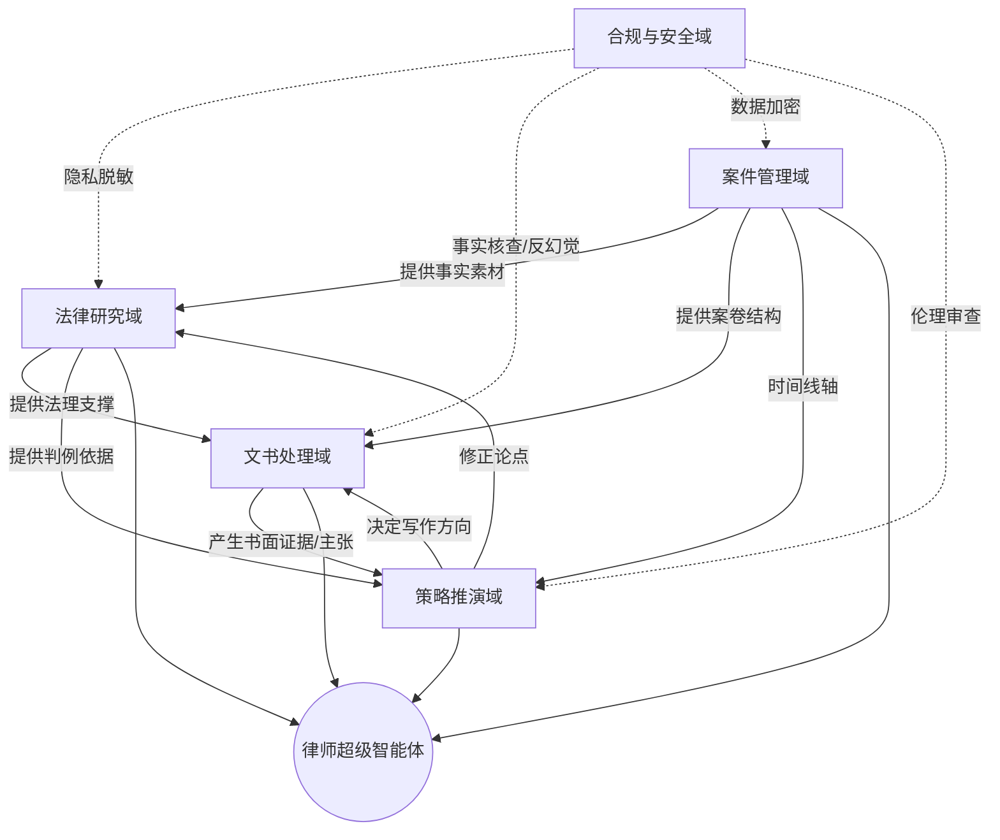

为了用**思维图谱（Graph of Thoughts, GoT）**的方式为你推理，我将不再采用简单的线性列表，而是将“律师AI智能体”的功能构建为一个**动态的知识图谱**。

在GoT框架中，我会将功能点视为**节点（Nodes）**，将它们之间的逻辑依赖、协同关系和递进关系视为**边（Edges）**。

---

### 🧠 思维图谱推理：律师 AI 智能体功能架构

#### 第一阶段：节点生成（Generation）
首先，我将律师的工作流拆解为五个核心功能域（基础节点）：
1.  **[法律研究域]** $\rightarrow$ 检索、分析、对比。
2.  **[文书处理域]** $\rightarrow$ 起草、审查、润色。
3.  **[案件管理域]** $\rightarrow$ 进度跟踪、证据链构建、日程提醒。
4.  **[策略推演域]** $\rightarrow$ 胜率预测、对抗性模拟、方案优化。
5.  **[合规与安全域]** $\rightarrow$ 隐私脱敏、权限控制、幻觉检测。

---

#### 第二阶段：构建图谱关系（Transformation & Aggregation）
现在，我将这些节点通过逻辑边连接，形成一个相互作用的网络。

**图谱逻辑关系图：**
*(注：$\rightarrow$ 表示支撑/输入，$\leftrightarrow$ 表示双向协同，$\dashrightarrow$ 表示约束)*

---

#### 第三阶段：基于图谱的深度功能推理（Reasoning Path）

通过上述图谱，我们可以推导出该智能体**不应仅仅是“聊天机器人”，而应是“协同系统”**。以下是基于节点交互推导出的具体功能：

##### 1. 从 [研究] $\rightarrow$ [文书] 的推导：**【智能引用与自动标注】**
*   **推理**：既然研究支撑文书，AI不应只给答案，而应在起草法律意见书时，**自动在正文中插入精准的法条链接和判例索引**，实现“论点 $\rightarrow$ 证据 $\rightarrow$ 法条”的闭环。

##### 2. 从 [案件管理] $\rightarrow$ [策略推演] 的推导：**【证据链自动化构建】**
*   **推理**：案件管理中的事实素材（时间线、证人证言）应自动转化为策略推演的输入。AI应能**自动识别证据缺失点**（例如：“对方主张 A，但目前证据链中缺失 B 环节”），并提醒律师补充搜集。

##### 3. 从 [策略推演] $\leftrightarrow$ [法律研究] 的推导：**【对抗性模拟（Red Teaming）】**
*   **推理**：策略域与研究域的双向箭头意味着 AI 可以扮演“对方律师”。它可以基于现有判例，**模拟对方可能提出的反驳观点**，并反向驱动研究域寻找应对的法律依据。

##### 4. 从 [合规安全] $\dashrightarrow$ [全域] 的推导：**【法律幻觉拦截器】**
*   **推理**：由于法律的严谨性，AI不能有“幻觉”。必须建立一个**双路验证机制**：一路由LLM生成，另一路由 RAG（检索增强生成）在权威法律数据库中进行硬匹配，不匹配则标记为“待核实”。

---

### 最终结论：功能清单（按图谱层级）

基于 GoT 推理，一个成熟的律师 AI 智能体应具备以下功能矩阵：

| 维度 | 核心功能点 | 对应的 GoT 逻辑 |
| :--- | :--- | :--- |
| **感知层 (Input)** | 多模态案卷数字化、自动时间线提取、证据分类 | $\text{案件管理} \rightarrow \text{基础数据}$ |
| **认知层 (Process)** | 跨判例类比分析、法理逻辑漏洞检测、法律实务 RAG | $\text{研究} \leftrightarrow \text{策略}$ |
| **执行层 (Output)** | 结构化文书起草、合同条款风险扫描、自动生成庭审大纲 | $\text{研究} + \text{策略} \rightarrow \text{文书}$ |
| **策略层 (Advanced)** | 案件胜率量化评估、对方律师模拟对抗、法律方案多路径推演 | $\text{综合全域} \rightarrow \text{策略推演}$ |
| **底座层 (Security)** | 法律专有词库、私有化部署、引用溯源、敏感信息自动掩码 | $\text{合规安全} \dashrightarrow \text{所有功能}$ |

**总结：** 律师 AI 智能体的核心竞争力不在于“生成文本”，而在于**【事实 $\rightarrow$ 法律 $\rightarrow$ 策略 $\rightarrow$ 文书】**这一逻辑链路的自动化协同。